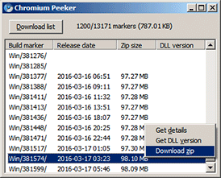

# Chromium Peeker

A native C++11 Win32 utility to download a list of [Chromium builds](http://commondatastorage.googleapis.com/chromium-browser-continuous) for Windows, allowing info fetching and ZIP package download.

## WinLamb library

This project uses [WinLamb](https://github.com/rodrigocfd/winlamb) library in a [submodule](http://blog.joncairns.com/2011/10/how-to-use-git-submodules).

After cloning the repository, pull the submodule files by running:

    git submodule init
    git submodule update

### Showcase

The project showcases the following WinLamb features:

* main and modal dialogs;
* multi-threaded background operations;
* listview control;
* progress indicator on taskbar;
* download files from the Internet;
* manipulate XML documents;
* unzip files.